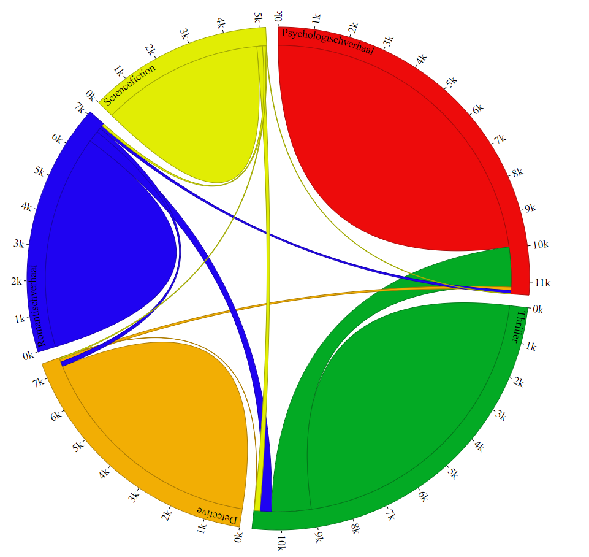
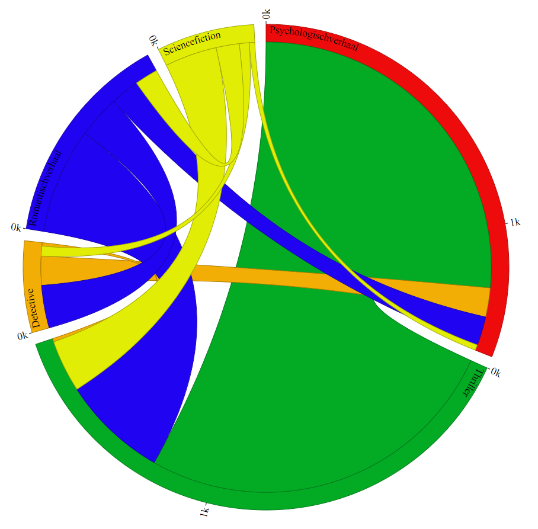
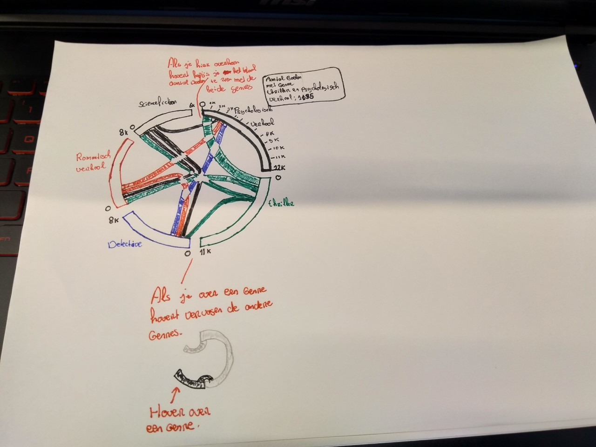
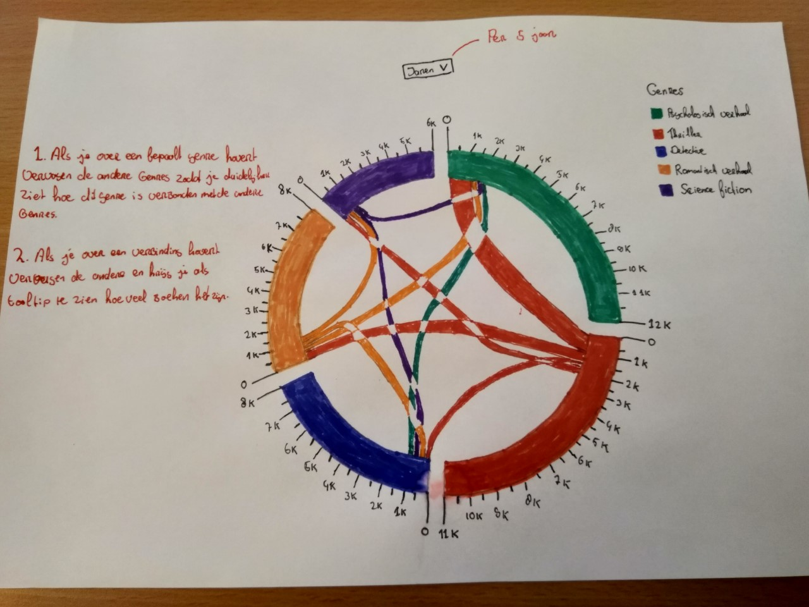
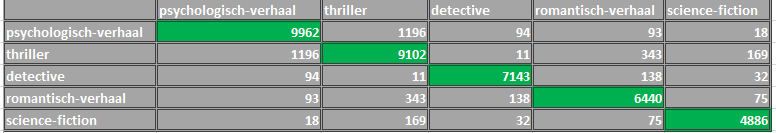

# Frontend data
Deze repo is voor het project frontend data. Hierin ga ik een interactieve datavisualisatie maken met de data van de OBA api.

## Inhoud
* [To Do](#to-do)
* [Installatie](#installatie)
* [Ideeën](#ideeën)
* [Schetsen](#schetsen)
* [Problemen](#problemen)
* [Werking](#werking)
* [Visualisatie](#visualisatie)
* [Shout outs](#shout-outs)
* [Bronnen](#bronnen)
* [Licentie](#licentie)

## To-Do

Tijdens dit project wil ik de volgende dingen gaan doen.

- [X] Data ophalen uit de oba api
- [X] Bedenken wat ik wil gaan visualiseren
- [X] Statische visualisatie maken met D3
- [X] Juiste data toevoegen aan deze statische visualisatie
- [X] Interactie toevoegen aan de visualisatie *is deels gelukt*

## Instalatie
Om dit project te installeren ga je naar je *terminal* en voer je dit uit : 
```
git clone https://github.com/Roene/frontend-data
cd frontend-data
npm install rijkvanzanten/node-oba-api
npm install
```
Dit project maakt gebruik van de volgende packages :
* [node-oba-api](https://github.com/rijkvanzanten/node-oba-api)
* [dotenv](https://www.npmjs.com/package/dotenv)

## Ideeën
Mijn eerste idee was om autheurs te gaan gebruiken voor de visualisatie. Wanneer de gebruiker hierop klikt krijgt hij zij de genres te zien van de autheur. Klikt de gebruiker op een genre dan krijgt hij de boeken van de bepaalde autheur. 

*Na de feedback van Bas Pieren op 12-11-2018 kwam ik tot een nieuw inzicht om dit andersom te gaan doen* 

Ik wil genres gaan gebruiken voor mijn visualisatie, wanneer de gebruiker hierop klikt moet hij/zij de autheurs binnen dit genre kunnen zien. Vervolgens wil ik dat als de gebruiker op de autheur klikt hij/zij de boeken te zien krijgt van deze autheur binnen een genre.

*14-11-2018 Feedback van Laurens, Jesse & Loc*

Mijn idee wat hierboven staat was nog niet zo concreet en niet zo interessant. Aangezien er boeken met meerdere genres zijn kwam Laurens met het idee om de 5 genres tegen elkaar uit te zetten, zodat je kunt zien hoe deze genres bij elkaar horen dus bijvoorbeeld thriller ten opzichte van romantiek. Dit zou je kunnen visualiseren door een [Chord-diagram](https://beta.observablehq.com/@mbostock/d3-chord-diagram) te gebruiken. Met dit concept ga ik dan ook door. 

De genres die ik wil gaan gebruiken zijn :
* Pyschologisch verhaal
* Thriller
* Detective
* Romantisch verhaal
* Science fiction 

Dit zijn de grootste 5 genres van de OBA. 

*15-11-2018 Voorbeelden*
Ik ben gaan kijken naar voorbeelden van chord diagrams, vervolgens ben ik gaan kijken of ik deze werkend kreeg. Dit [voorbeeld](http://blockbuilder.org/mbostock/4062006) heb ik werkend gekregen.

*15-11-2018 Feedback*
Aan het einde van deze dag hebben we het idee gepitcht aan de klas. Ik had nog geen idee van welke interactie ik ga gebruiken, vanuit de klas kreeg ik tips om bijvoorbeeld extra genres toe te voegen of andere jaren te selecteren ipv alles.

Ik ga als interactie toevoegen dat gebruikers andere jaren kunnen selecteren. 

*19-11-2018*
Omdat ik niet de boeken ophaal met jaar maar alleen het totaal aantal in een bepaald genre ga ik niks met jaar en internactie doen, maar wil ik de gebruiker een mogelijkheid geven om een extra genre toevoegen (verhalenbundel).

*21-11-2018*
Na een kort gesprek met Laurens heb ik het idee voor de interactie aanpassen. De eerst chort is een totaal overzicht :

> Totaal overzicht


> Alleen dubbele genres

De buitenkant van de chord, ook wel arc's / labels zijn het totaal aantal boeken binnen dit genre. De ribbons / labels zijn steeds het totaal aantal boeken met dubbele genres.

## Interessante charts
Deze charts vond ik tot nu toe interessant om voor mijn idee te gebruiken en om de visualisatie interactief te maken.
* Sunburst chart 📊
* Bubble chart
* Chord diagram (na feedback op 14-11-2018)

*13-11-2018 Ik ben nog meer charts aan het zoeken voor inspiratie*

Tof voorbeeld voor een [interactieve sunburst](https://beta.observablehq.com/@mbostock/d3-zoomable-sunburst)

Dit is ook een tof voorbeeld van een [interactieve chord diagram](http://projects.delimited.io/experiments/chord-transitions/demos/trade.html)

## Schetsen
✏️📐📏


> Sunburst en bubble chart 


> Sunburst uitgewerkt


> 1e Chord diagram


> 2e Chord diagram

## Probelemen
* Wat wil ik visualiseren?
* Wat wil ik dat de gebruiker uit de data visualisatie kan halen zodat hij/zij de data kan gaan ontdekken?
* Welke charts ga ik hiervoor gebruiken?
* Welke charts vind ik zelf interessant / leip om te maken?
* Wat zijn interessante patronen om te gebruiken?

*Andere probelemen :*
* Hoe haal ik alle boeken op uit een bepaald genre?
* Hoe ga ik de chord diagram maken ? 😨😨😨
* Hoe ga ik interactie toevoegen? 😨😨😨

*19-11-2018*
* Ik heb nu het totaal aantal boeken per genre en het aantal boeken met dubbele genre.

*22-11-2018*
* Ik heb interactie kunnen toevoegen alleen werken de ticks nu niet meer 😥😥
* Ik heb een tooltip toegepast om het totaal aantal boeken te bekijken. De eerste keer werkt deze nog niet, zodra je op de button alleen dubbele genres hebt geklikt werkt deze wel.

## Werking
Ik ben erachter gekomen hoe ik de data in kan laden : 
```js
var data = [
  [9962, 1196, 94, 93, 18],
  [1196, 9102, 11, 343, 169],
  [94, 11, 7143, 138, 32],
  [93, 343, 138, 6440, 75],
  [18, 169, 32, 75, 4886]
]
``` 
Dit zijn gegevens van de boeken je kan het zo het makkelijkste uitlezen :


Zoals je hier ziet is de groene cel naar zichzelf, de rest is steeds naar een ander genre. Als je alles bij elkaar optelt kom je bij het totaal van de boeken uit van dit bepaalde genre. 

Om de update te updaten heb ik een 2e matrix tabel gemaakt. Er moet een nullen ingezet worden om hem vierkant te houden, hierdoor verwijder je de chords naar zichzelf (zie afbeelding totaal overzicht).
```js
var dataUpdate = [
  [0, 1196, 94, 93, 18],
  [1196, 0, 11, 343, 169],
  [94, 11, 0, 138, 32],
  [93, 343, 138, 0, 75],
  [18, 169, 32, 75, 0],
]
```
## Visualisatie
De visualisatie is [hier](https://roene.github.io/frontend-data/datavis/) te vinden.

## Shout outs
🙏🏻 Special thanks naar deze mensen die mij hebben geholpen tijdens dit project. 🙏🏻
* [Bas Pieren](https://github.com/BasPieren) Voor het halen van ☕.
* [Daniel van de Velde](https://github.com/DanielvandeVelde) Voor de readme over de OBA api.
* [Sterre van Geest](https://github.com/sterrevangeest/frontend-data/blob/master/data/index.js) Voor de code om totaal aantal boeken per genre op te halen. 

## Bronnen
De volgende bronnen heb ik gebruikt voor dit project :
* Project is gebasseerd op [chord diagram](https://beta.observablehq.com/@mbostock/d3-chord-diagram)
* Voor het begrijpen van de [matrix tabel](https://www.delimited.io/blog/2013/12/8/chord-diagrams-in-d3) zie afbeelding *Table of Hair Color Data*
* Voorbeelden waar ik delen van heb gebruikt, [voorbeeld 1](https://jsfiddle.net/rjonean4/) & [voorbeeld 2](https://jsfiddle.net/wcat76y1/5/)
* Documentatie van de [Oba api](https://zoeken.oba.nl/api/v1/) 

## Licentie
[MIT](https://choosealicense.com/licenses/mit/) © [Roene Verbeek](https://github.com/Roene)