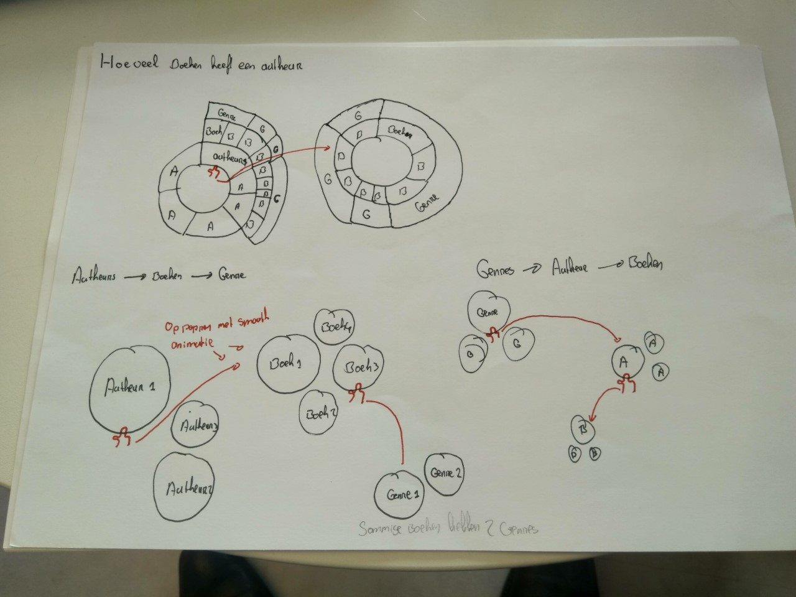
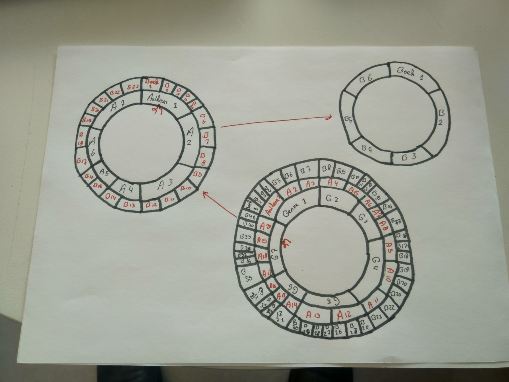

# Frontend data
Deze repo is voor het project frontend data. Hierin ga ik een interactieve datavisualisatie maken met de data van de OBA api.

## Inhoud
* [To Do](#to-do)
* [Installatie](#installatie)
* [Problemen](#problemen)
* [Schetsen](#schetsen)
* [Ideeën](#ideeën)
* [Observable](#observable)
* [Shout outs](#shout-outs)
* [Licentie](#licentie)

## To-Do

- [X] 
- [ ]
- [ ]
- [ ]
- [ ]
- [ ]

## Instalatie
Om dit project te installeren ga je naar je *terminal* en voer je dit uit : 
```
git clone https://github.com/Roene/frontend-data
cd frontend-data
npm install rijkvanzanten/node-oba-api
npm install
```
Dit project maakt gebruik van de volgende packages :
* [node-oba-api](https://github.com/rijkvanzanten/node-oba-api)
* [dotenv](https://www.npmjs.com/package/dotenv)

## Probelemen
* Wat wil ik visualiseren?
* Wat wil ik dat de gebruiker uit de data visualisatie kan halen zodat hij/zij de data kan gaan ontdekken?
* Welke charts ga ik hiervoor gebruiken?
* Welke charts vind ik zelf interessant / leip om te maken?

## Schetsen
✏️📐📏


> Sunburst en bubble chart 


> Sunburst uitgewerkt

## Ideeën
Mijn eerste idee was om autheurs te gaan gebruiken voor de visualisatie. Wanneer de gebruiker hierop klikt krijgt hij zij de genres te zien van de autheur. Klikt de gebruiker op een genre dan krijgt hij de boeken van de bepaalde autheur. 

*Na de feedback van Bas Pieren op 12-11-2018 kwam ik tot een nieuw inzicht om dit andersom te gaan doen* 

Ik wil genres gaan gebruiken voor mijn visualisatie, wanneer de gebruiker hierop klikt moet hij/zij de autheurs binnen dit genre kunnen zien. Vervolgens wil ik dat als de gebruiker op de autheur klikt hij/zij de boeken te zien krijgt van deze autheur binnen een genre.

## Interessante charts
Deze charts vond ik tot nu toe interessant om voor mijn idee te gebruiken en om de visualisatie interactief te maken.
* Sunburst chart 📊
* Bubble chart

*13-11-2018 Ik ben nog meer charts aan het zoeken voor inspiratie*

Tof voorbeeld voor een [interactieve sunburst](https://beta.observablehq.com/@mbostock/d3-zoomable-sunburst)

## Observable

## Shout outs
🙏🏻 Special thanks naar deze mensen die mij hebben geholpen tijdens dit project. 🙏🏻
* [Bas Pieren](https://github.com/BasPieren) voor het halen van ☕

## Licentie
[MIT](https://choosealicense.com/licenses/mit/) © [Roene Verbeek](https://github.com/Roene)